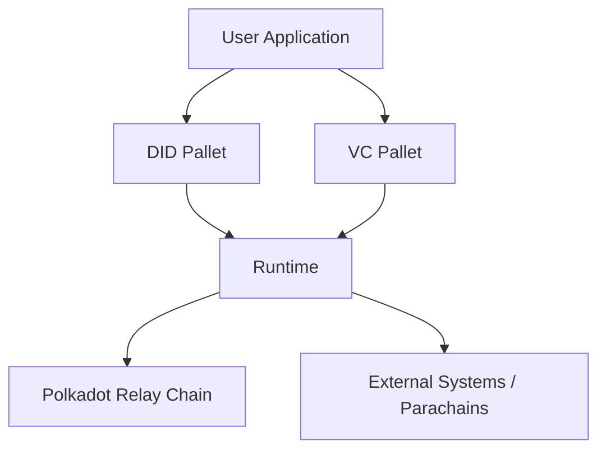

**Whitepaper: Polka-DID-Chain**

**Version 1.0 - October 2024**

**Abstract**  
Polka-DID-Chain is a decentralized identity management solution built on the Substrate blockchain framework, designed to empower individuals with self-sovereign identity and ensure data privacy. This whitepaper introduces the architectural design of Polka-DID-Chain, explains its core components, and provides an overview of its application scenarios. By leveraging the interoperability and scalability of the Polkadot ecosystem, Polka-DID-Chain delivers an identity management solution that is both flexible and secure.

**1. Introduction**  
Centralized identity management systems pose significant challenges, including privacy concerns, single points of failure, and a lack of individual ownership over personal data. Polka-DID-Chain addresses these challenges by providing a decentralized, user-controlled system for managing digital identities. Utilizing DIDs and verifiable credentials (VCs), users maintain complete control of their identities while minimizing the risk of data breaches and enhancing privacy.

**2. Problem Statement**  
Traditional identity systems are controlled by central authorities, which limits user autonomy and presents security vulnerabilities. The rise in data breaches highlights the need for a privacy-preserving, self-sovereign solution. Users need to verify and share their information securely without relying on third-party providers. A decentralized identity solution that is scalable, flexible, and interoperable across multiple blockchain networks is the answer.

**3. Objectives**  
- To establish a user-centric identity solution where individuals fully own and manage their identities.
- To enable the issuance and verification of verifiable credentials.
- To provide interoperability across various blockchains, ensuring that identity can be verified and trusted regardless of platform.

**4. Architecture Overview**

Polka-DID-Chain leverages Substrate's modular architecture to provide the core functionalities required for decentralized identity management. The main components include:

- **DID Module**: A pallet responsible for managing decentralized identifiers and associated metadata.
- **VC Module**: Handles verifiable credential issuance and revocation.
- **Runtime Integration**: Ensures that the identity system can be easily incorporated into a runtime environment for full-chain integration.

**4.1. Architectural Diagram**

*Diagram: High-level overview of Polka-DID-Chain Architecture*

- **DID Pallet**: Manages the creation, update, and deletion of DIDs, providing an on-chain mechanism for identity registration. Each DID is associated with a public key for cryptographic verification and a service endpoint to link off-chain services.

- **VC Pallet**: Supports the issuance and revocation of verifiable credentials, allowing issuers to create credentials tied to an individual's DID. This functionality provides a mechanism for proof of credentials such as certificates, licenses, and more.

- **Polkadot Ecosystem Integration**: Through Polkadot's relay chain and parachain architecture, Polka-DID-Chain can operate as an independent parachain or be integrated into existing parachains, ensuring high scalability and cross-chain interoperability.

**4.2. Smart Contract Layer**  
The VC issuance and verification mechanisms can be enhanced through the smart contract layer, which interacts with other parachains or external systems. The contracts facilitate verifiable credential transactions, including tokenized incentives for verified users.

**5. Key Features**

**5.1. Self-Sovereign Identity (SSI)**  
With Polka-DID-Chain, individuals are at the center of their identity management. Each DID is owned by the user and can be used across platforms without reliance on a single centralized authority.

**5.2. Verifiable Credentials (VCs)**  
VCs provide a mechanism for attesting claims about an individual's attributes. This could range from academic degrees to government-issued certifications. The credential can be easily verified while preserving privacy.

**5.3. Privacy and Security**  
- **Encryption**: All verifiable credentials and DID documents are cryptographically secured.
- **Revocation Mechanism**: Credentials can be revoked by the issuer, preventing misuse or fraud.

**6. Technical Components**

**6.1. DID Document**  
The DID document is the core data structure associated with a DID. It contains the public key for verifying digital signatures and a service endpoint for interacting with other services or resolving further information.

**6.2. VC Structure**  
A verifiable credential comprises the following:
- **Issuer**: The entity that issues the credential.
- **Subject**: The entity to whom the credential is issued.
- **Credential Data**: The actual information being attested.
- **Credential Type**: E.g., "Degree", "License".
- **Cryptographic Proof**: Signature proving the authenticity of the credential.

**6.3. Runtime Integration and Pallet Development**  
- The runtime configuration integrates the DID and VC pallets, making the identity features accessible across the blockchain.
- The pallets are configured to store DIDs using a secure hashing algorithm (Blake2_128Concat) for mapping account identifiers to their DID documents.

**7. Application Scenarios**

**7.1. Digital Identity for the Metaverse**  
With the increasing adoption of the metaverse, self-sovereign identity is crucial for users to establish secure and persistent identities. Users can leverage their DID to log in to multiple platforms within the metaverse ecosystem.

**7.2. Cross-Border Credential Verification**  
Credentials such as degrees, licenses, or work certifications can be verified across borders using Polka-DID-Chain, which eliminates lengthy bureaucratic processes.

**7.3. Healthcare and Medical Records**  
Patients can use DIDs to manage and control their medical records. Only authorized medical practitioners can access specific parts of the patient’s records, ensuring data privacy while maintaining accessibility when needed.

**8. Security and Privacy**

**8.1. Cryptographic Keys**  
Every DID is linked to a unique public-private key pair. Only the individual possessing the private key can control or update their DID document, ensuring privacy and self-sovereignty.

**8.2. Revocation Mechanism**  
VCs are designed with a built-in revocation capability, allowing issuers to retract credentials if deemed necessary. This protects the authenticity of credentials in the network.

**9. Implementation and Development**

**9.1. Development Environment**  
The project is built using **Rust** and leverages Substrate’s FRAME framework for runtime logic. It follows standard Substrate conventions, enabling easy extensibility for future improvements.

**9.2. Testing**  
Unit tests for each pallet ensure the correctness of the DID and VC logic, using a mock runtime. Testing scripts include scenarios like DID creation, credential issuance, updates, and revocations.

**10. Future Roadmap**

- **Cross-Chain DID Resolution**: Interoperability with different parachains for decentralized identity verification across ecosystems.
- **Decentralized Storage Integration**: Leveraging IPFS or similar technologies to store large verifiable credentials off-chain while maintaining their link on-chain.
- **Mobile Identity Wallet**: Developing a mobile app for managing DIDs and VCs.

**11. Conclusion**
Polka-DID-Chain is poised to revolutionize digital identity management in the blockchain space by enabling secure, private, and self-sovereign identities. Through interoperability within the Polkadot ecosystem, the project ensures that identity verification can be trusted across networks and provides the foundation for a privacy-focused, user-controlled digital future.

**References**
- Polkadot Documentation: https://polkadot.network
- Substrate Developer Hub: https://docs.substrate.io
- W3C DID Specification: https://www.w3.org/TR/did-core

---

**Appendix**
- **Glossary**:
  - **DID**: Decentralized Identifier.
  - **VC**: Verifiable Credential.
  - **SSI**: Self-Sovereign Identity.
- **Acknowledgments**: Thanks to the Substrate and Polkadot developer community for their support in building decentralized solutions.
